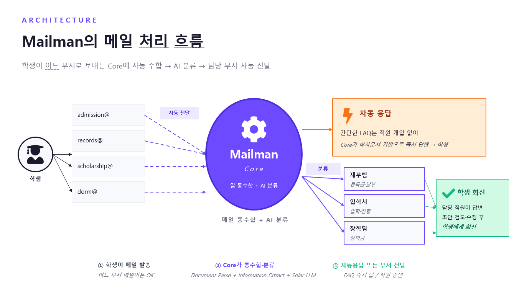
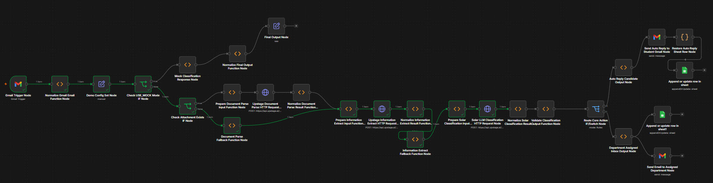
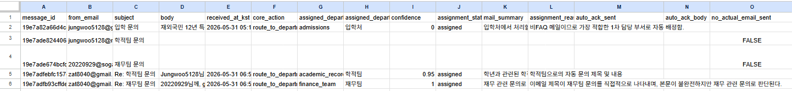
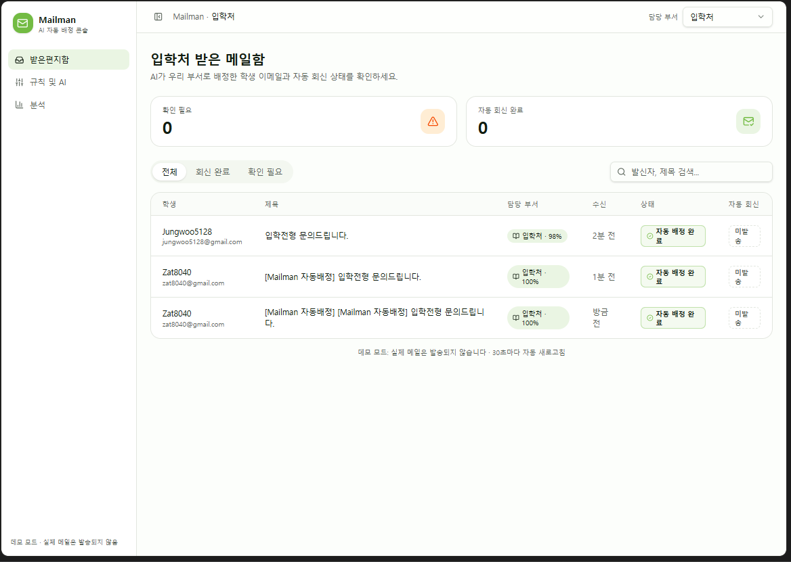

# 대학 행정 문의 자동화 서비스

대학 행정실로 들어오는 문의 메일과 첨부 서류를 AI로 분석해 담당 부서를 분류하고, 답변 초안을 생성하는 행정 자동화 프로토타입입니다.

## 문제 정의

입학처나 학사지원 부서에는 장학금, 등록금, 학적 증명처럼 실제 담당 부서가 다른 문의가 자주 들어옵니다. 특히 첨부 서류가 포함된 경우 직원이 직접 파일을 열어보고 문의 유형과 담당 부서를 판단해야 하므로 반복적인 행정 업무가 발생합니다.

## 구현 방식

이 프로젝트의 핵심은 Lovable UI가 아니라 n8n 기반 자동화 워크플로우입니다.

n8n에서 메일 입력을 받아 첨부파일 여부를 확인하고, Upstage API를 활용해 문서 분석과 정보 추출을 수행했습니다. 이후 Solar LLM을 통해 문의 유형과 담당 부서를 분류하고, 직원이 검토할 수 있는 답변 초안과 라우팅 요약을 생성했습니다.

Lovable은 해커톤 필수 활용 조건에 맞춰 직원이 AI 결과를 확인하는 검토용 대시보드 UI 제작에 사용했습니다.

## 주요 기능

- 메일 제목/본문 분석
- 첨부 서류 내용 분석
- 학생 정보 및 문의 유형 추출
- 담당 부서 자동 분류
- 답변 초안 생성
- 신뢰도 낮은 문의 수동 검토 처리
- 직원 검토용 대시보드

## 사용 기술

- n8n
- Upstage Document Parse
- Upstage Information Extract
- Solar LLM
- Lovable
- React / Vite

## 문서

- [n8n Workflow 설명](docs/workflow.md)
- [Architecture](docs/architecture.md)
- [n8n Workflow Export](workflows/mailman-n8n-workflow-sanitized.json)

> workflow export 파일은 credential, API key, webhook URL 등 민감정보를 제거한 sanitized 버전입니다.

## Screenshots

### 전체 구조

### n8n 자동화 워크플로우

### Mailman Core 처리 흐름

### 직원 검토 대시보드

## 프로젝트 성과

Upstage AI 해커톤에서 구현한 프로젝트이며, 최우수상을 수상했습니다.

## 레포지토리 구성

- `src/`: Lovable로 제작한 직원 검토용 대시보드 코드
- `docs/workflow.md`: n8n 중심 처리 흐름 설명
- `docs/architecture.md`: 전체 서비스 구조 설명

## 참고

본 레포지토리에는 직원 검토용 대시보드 코드와 워크플로우 설명 문서를 정리했습니다. 실제 프로토타입의 핵심 로직은 n8n 워크플로우에서 Upstage API와 Solar LLM을 연결해 구현했습니다.
